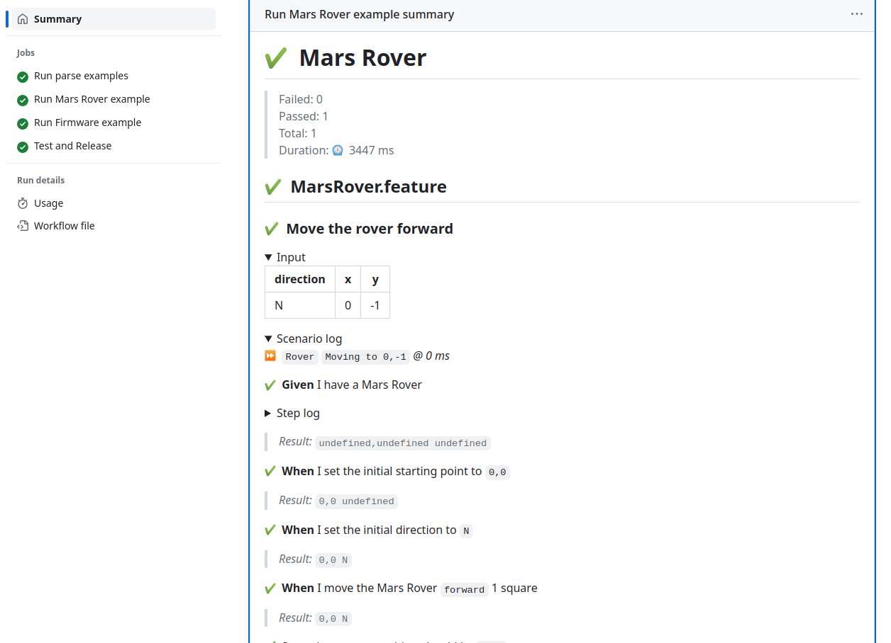
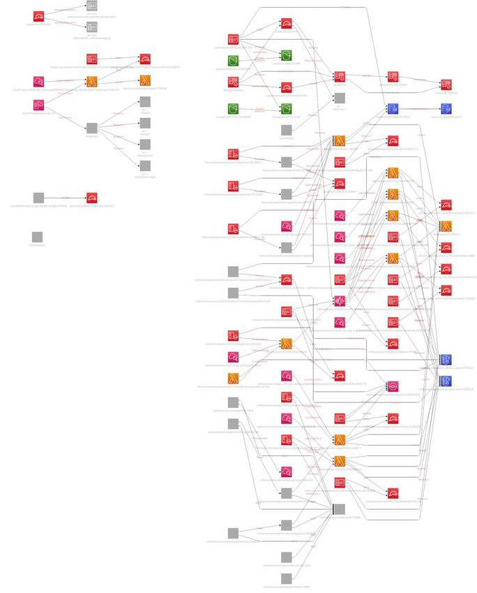
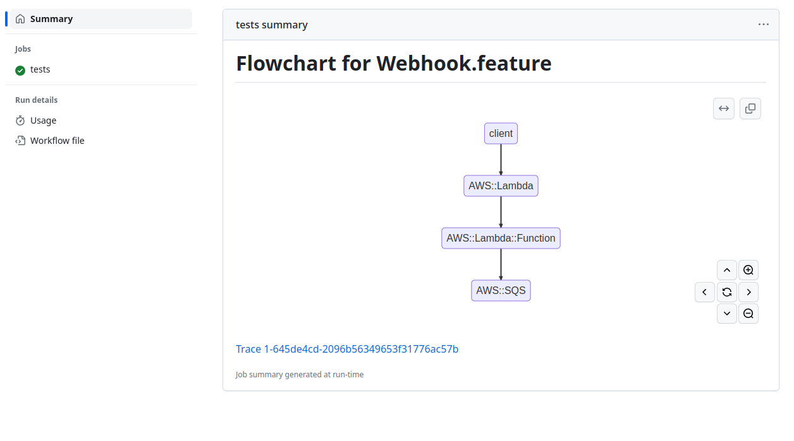

# Markus Tacker

:::::::::::::: {.columns}

::: {.column width=40%}

{width=50%}

:::

::: {.column width=48%}

Principal R&D Engineer  
Nordic Semiconductor  
Trondheim, Norway

[coderbyheart.com/socials](https://coderbyheart.com/socials)

<small>Pronouns: he/him</small>

:::

::::::::::::::

# Slides

{width=50%}

# Preface

I need to do
[a lot of end-to-end testing](https://coderbyheart.com/talks#it-does-not-run-on-my-machine-integration-testing-a-cloud-native-application),
but I am not _really_ happy with the tools.

So I wrote a _new_ test framework ... _\*sigh\*_.

I'd rather I didn't, but it actually adresses shortcomings I see with the tools
that _I_ use daily.

So let's have a look at what's missing...

# Need 1: Better way to write end-to-end tests

The way I write tests sucks...

# Gherkin intro

🫶🏻 Gherkin fully decouples test code from implementation, has been useful many
times for me.

This is Gherkin syntax
[from the source](https://cucumber.io/docs/gherkin/reference/):

```gherkin
Feature: Guess the word

  # The first example has two steps
  Scenario: Maker starts a game
    When the Maker starts a game
    Then the Maker waits for a Breaker to join

  # The second example has three steps
  Scenario: Breaker joins a game
    Given the Maker has started a game with the word "silky"
    When the Breaker joins the Maker's game
    Then the Breaker must guess a word with 5 characters
```

# Notes on how I use Gherkin

1. My scenarios intentionally are **NOT** following
   [the Gherkin recommendation](https://cucumber.io/docs/bdd/better-gherkin/)
   (because the user is a machine)

2. we don't have business people writing the scenarios.

# Using Gherkin in my projects: Example

```gherkin
Feature: Device Messages

  Devices can publish arbitrary messages on the /messages topic and that
  the messages can then be queried in Timestream.

  Background:

    Given I am run after the "Device: Update Shadow" feature
```

😭 not well solved by Gherkin: **dependency on other Feature**

<div class="notes">

Examples used:

- https://github.com/NordicSemiconductor/asset-tracker-cloud-aws-js/blob/e620758645d9768ec55ac8e2512e43b9970dbb24/features/DeviceMessages.feature
- https://github.com/NordicSemiconductor/asset-tracker-cloud-aws-js/blob/0c88ee3bedc433b572b918642f41b5f31b2b5b50/features/CellGeolocationnRFCloud.feature#L6

</div>

# Device sends a message

```gherkin
  Scenario: Devices publishes that an impact was detected

    Given I store "$millis()" into "ts"
    Then the tracker publishes this message to the topic {tracker:id}/messages
      """
      {
      "impact": {
      "v": {magnitude},
      "ts": {ts}
      }
      }
      """
```

😭 not well solved by Gherkin: **low level API calls**

# Web app can retrieve message

```gherkin
    Given I am authenticated with Cognito
    When I run this Timestream query
      """
      SELECT measure_value::double AS value
      FROM "{historicaldataDatabaseName}"."{historicaldataTableName}"
      WHERE deviceId='{tracker:id}' AND measure_name='impact' AND measure_value::double IS NOT NULL
      ORDER BY time DESC
      """
    Then "timestreamQueryResult" should match this JSON
      """
      [
        {
          "value": {magnitude}
        }
      ]
      """
```

😭 not well solved by Gherkin: **eventual consistency**

# Run entire features multiple times

because it improves readability (needed because Note 1), and because of
per-Scenario retries

```gherkin
Feature: nRF Cloud Cell Geolocation

    Contexts:

    | nw    |
    | ltem  |
    | nbiot |

    Scenario: Query the cell

        Given I store "$millis()" into "ts"
        When I GET /cell?cell={cellId}&area=30401&mccmnc=24201&nw=<nw>&ts={ts}
```

😭 not well solved by Gherkin: **Gherkin only has examples per scenario**

# Let's improve Gherkin: BDD Markdown

[github.com/NordicSemiconductor/bdd-markdown-js](https://github.com/NordicSemiconductor/bdd-markdown-js)

- Dependencies
- Comments
- Formatted code
- Context
- Asynchronous results
- Retries

[Supported syntax](https://raw.githubusercontent.com/NordicSemiconductor/bdd-markdown-js/saga/parser/test-data/feature/Example.feature.md)

# Dependencies

```markdown
---
needs:
  - First feature
---

# Second

## Scenario

Given this is the first step
```

# Comments

```markdown
# Example feature

> This is a description for the feature.

<!-- Comments on separate lines are supported. They will be associated with the following keyword. -⟶

## The first scenario
```

# Formatted code

````markdown
## Verify that a webhook request was sent using the REST client

When I POST to `${webhookReceiver}/hook` with this JSON

```json
{ "foo": "bar" }
```
````

# Contexts

```markdown
---
contexts:
  - nw: ltem
    nw-modem: LTE-M
  - nw: nbiot
    nw-modem: NB-IoT
---
```

# Make eventual consistent behaviour first party citizen

```markdown
## Scenario Outline: Move the rover backward

Given I have a Mars Rover

When I set the initial starting point to `0,0`

And I set the initial direction to `${direction}`

And I move the Mars Rover `backward` 1 square

Soon the current position should be `${x},${y}`

### Examples

| direction | x   | y   |
| --------- | --- | --- |
| N         | 0   | 1   |
| S         | 0   | -1  |
| E         | -1  | 0   |
| W         | 1   | 0   |
```

<div class="notes">

- [`Soon` keyword](https://github.com/NordicSemiconductor/bdd-markdown-js/blob/dfa44aa6f7ea6c69087a8d333456f67d1069c550/examples/mars-rover/MarsRover.feature.md#hit-an-obstacle)

</div>

# Retries

```markdown
---
# Configure the retry settings for the entire feature
retry:
  tries: 10
  initialDelay: 250
  delayFactor: 2
---

# To Do List

<!-- This @retry:tries=5 applies to all steps in the scenario. -⟶

## Create a new todo list item

Given I create a new task named `My item`

<!-- This @retry:tries=3,initialDelay=100,delayFactor=1.5 applies only to the next step. -⟶

Soon the list of tasks should contain `My item`
```

# Bonus: Integrate Markdown with GitHub Actions



<div class="notes">

- <https://github.blog/2022-05-09-supercharging-github-actions-with-job-summaries/>
- <https://github.com/NordicSemiconductor/bdd-markdown-js/actions/runs/4954467574#summary-13422645884>

</div>

# Need 2: I need architecture diagrams

- Understanding a system purely from tests doesn't work
- Manually creating architecture diagrams works, but maintaining is a mess

# Example: Backend Architecture diagrams using C4 and Miro

- [c4model.com](https://c4model.com/)

# System Context Diagram


# Container Diagram


# Component Diagram


# Problems

- Hard to build
- even harder to maintain
- static

# Let's automate this!

[I've generated](https://coderbyheart.com/twitter/status/1381512195612246018) an
architecture diagram of _one of the stacks_ in this solution

# Result



# It shows that

- auto-generating diagrams is pretty useless
- a lot of the "magic" of AWS solutions is in the configurations and typical
  architecture diagrams are bad at visualizing this.

# Solution: Create from test runs

- Generate architecture diagrams
  [from test runs](https://github.com/NordicSemiconductor/cloud-bdd-markdown-e2e-example-aws-js)



<div class="notes">

[Example](https://github.com/NordicSemiconductor/cloud-bdd-markdown-e2e-example-aws-js/actions/runs/4956101677#summary-13426591516)

</div>

# The Future? Combine everything in one UI!


# Interactive Feature and Architecture Explorer™

- Put the flow of events first!  
  We understand systems from how they behave, not how they are constructed.
- Filter by feature ⟶ show only the components and events used
- Filter by component ⟶ which features use this component?
  - Which features have a lot of overlap in component usage
- Inventory of all events ⟶ filter events that include e.g. an email, which
  components are used?

# The sky is the limit

... if we start improving the tools that we use to get our work done.

# Thank you

<div class="text-center">

Please share your feedback!

<small>[coderbyheart.com/socials](https://coderbyheart.com/socials)</small>

<small>Latest version:  
[`bit.ly/better-test-tools`](https://bit.ly/better-test-tools)</small>

</div>
