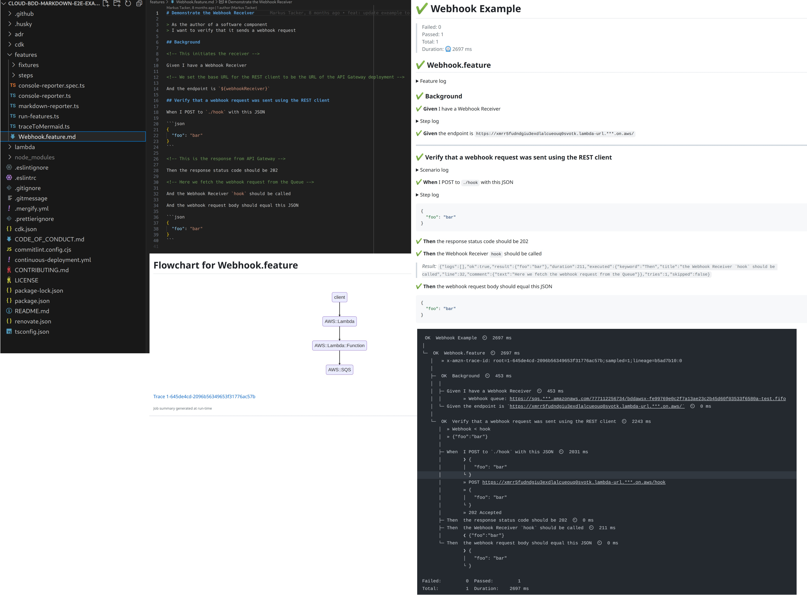

# Markus Tacker

:::::::::::::: {.columns}

::: {.column width=40%}

{width=50%}

:::

::: {.column width=48%}

Principal R&D Engineer  
Trondheim

[\@coderbyheart@chaos.social](https://chaos.social/@coderbyheart)

<small>Pronouns: he/him</small>

:::

::::::::::::::

# Preface

I need to do
[a lot of end-to-end testing](https://coderbyheart.com/talks#it-does-not-run-on-my-machine-integration-testing-a-cloud-native-application),
but I am not _really_ happy with the tools.

So I wrote a _new_ test framework: _\*sigh\*_.

I'd rather I didn't, but it actually adresses the main shortcomings I see with
the tools that _I_ know to be available.

So let's have a look at what's missing...

# Need 1: Better way to write end-to-end tests

The way I write tests sucks...

# Gherkin intro

This is Gherkin syntax
[from the source](https://cucumber.io/docs/gherkin/reference/):

```gherkin
Feature: Guess the word

  # The first example has two steps
  Scenario: Maker starts a game
    When the Maker starts a game
    Then the Maker waits for a Breaker to join

  # The second example has three steps
  Scenario: Breaker joins a game
    Given the Maker has started a game with the word "silky"
    When the Breaker joins the Maker's game
    Then the Breaker must guess a word with 5 characters
```

# Using Gherkin in my projects

[Example](https://github.com/NordicSemiconductor/asset-tracker-cloud-aws-js/blob/e620758645d9768ec55ac8e2512e43b9970dbb24/features/DeviceMessages.feature)

Problems not well covered by Gherkin:

- low level API calls
- dependency to other Feature
- asynchronous result

Note: This is intentionally **NOT** following
[the Gherkin recommendation](https://cucumber.io/docs/bdd/better-gherkin/)
(because client is a machine)

Note 2: we don't have business people writing the scenarios.

# Improve Gherkin: BDD Markdown

<https://github.com/NordicSemiconductor/bdd-markdown-js>

[Supported syntax](https://raw.githubusercontent.com/NordicSemiconductor/bdd-markdown-js/saga/parser/test-data/feature/Example.feature.md)

- Dependencies
- Retries
- Comments
- Formatted code
- Tables for examples

# Improve test runner: make asynchronous behaviour first party citizen

- [`Soon` keyword](https://github.com/NordicSemiconductor/bdd-markdown-js/blob/dfa44aa6f7ea6c69087a8d333456f67d1069c550/examples/mars-rover/MarsRover.feature.md#hit-an-obstacle)

# Integrate Markdown with GitHub Actions

<https://github.com/NordicSemiconductor/bdd-markdown-js/actions/runs/4954467574#summary-13422645884>

# Need 2: I need architecture diagrams

- Manually creating them works, but maintaining is a mess

# Example: Backend Architecture diagrams using C4 and Miro

- [C4 model](https://c4model.com/)

# System Context Diagram


# Container Diagram


# Component Diagram


# Solution: Create from test runs

Generate architecture diagrams
[from test runs](https://github.com/NordicSemiconductor/cloud-bdd-markdown-e2e-example-aws-js "‌")

[Example](https://github.com/NordicSemiconductor/cloud-bdd-markdown-e2e-example-aws-js/actions/runs/4956101677#summary-13426591516)

# The Future? Combine everything in one UI!



# Interactive Architecture Diagram

We need to put the flow of events first

- Show all the Features, filter by feature -> show only the components and
  events used
- Show all the components, filter by component -> which features use this
  component?
  - Which features have a lot of overlap in component usage
- Inventory of all events -> filter events that include e.g. an email, which
  components are used?

# Thank you

<div class="text-center">

Please share your feedback!

<small>[m@coderbyheart.com](mailto:m@coderbyheart.com)  
[\@coderbyheart@chaos.social](https://chaos.social/@coderbyheart)</small>

<small>Latest version:  
[`bit.ly/better-test-tools`](https://bit.ly/better-test-tools)</small>

We are hiring!  
[nordicsemi.com/jobs](https://nordicsemi.com/jobs)  
<small>Trondheim &middot; Oslo &middot; 20+ more locations</small>

</div>
